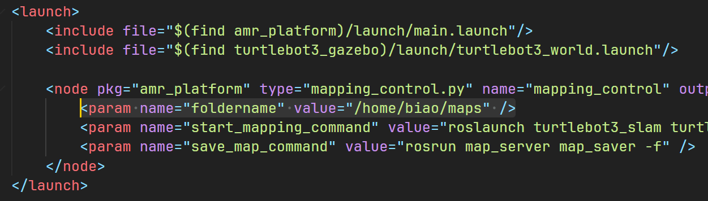
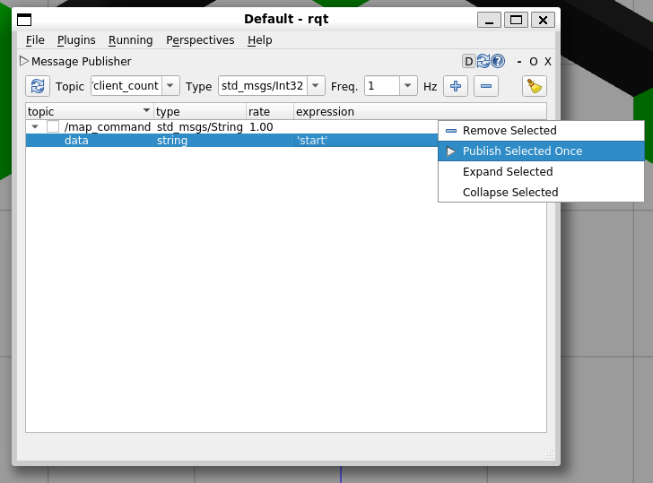
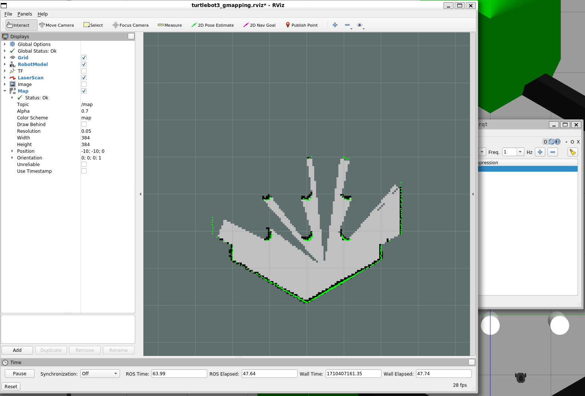

# AMR Remote Control Toolkit

By using this package, you can achieve below functions by sending topic for your 2D AMR:

- launch slam algorithm
- save map
- load map files and launch amcl

It is encouraged to use [legubiao/ros2d-quasar](https://github.com/legubiao/ros2d-quasar) as well.

[中文说明](README_CN.md)

## Installation

install rosbridge-server

```
sudo apt-get install ros-humble-rosbridge-server
```

clone the repository

```shell
cd ~/ros2_ws/src
git clone https://github.com/legubiao/AMR-Remote-Control-Toolkit
cd AMR-Remote-Control-Toolkit
git checkout humble
cd ../..
colcon build
```

## Try with Turtlebot3 Simulation

Install TurtleBot3 Packages

```shell
sudo apt install ros-noetic-dynamixel-sdk ros-noetic-turtlebot3-msgs ros-noetic-turtlebot3
```

Install gmapping and dwa local planner

```shell
sudo apt-get install ros-noetic-gmapping ros-noetic-dwa-local-planner
```

Install TurtleBot3 Simulation Package

```shell
cd ~/catkin_ws/src
git clone -b kinetic-devel https://github.com/ROBOTIS-GIT/turtlebot3_simulations.git
cd ~/catkin_ws && catkin_make
```

Set Default TurtleBot3 Model

```shell
echo "export TURTLEBOT3_MODEL=burger" >> ~/.bashrc
source ~/.bashrc
```

Modified the default map folder in `launch/turtlebot.launch`



Launch the demo

```shell
roslaunch amr_rctk turtlebot.launch
```

You can launch gmapping by send to `map_command` topic



The slam node will be started and rviz will popup



In order to save map, just send `save YOUR_MAP_NAME` to the `map_command` topic