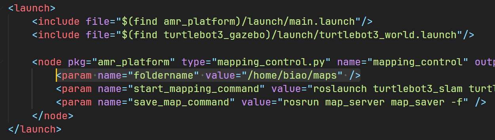
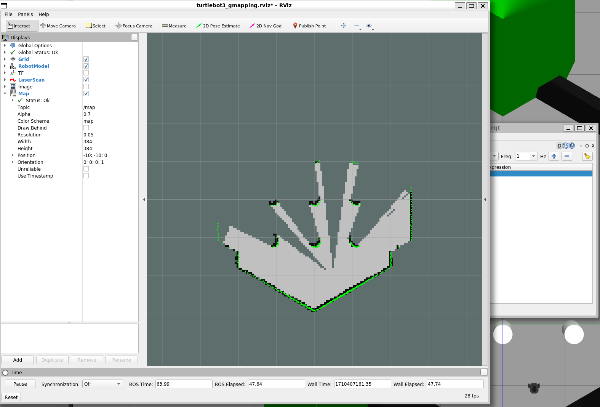

# AMR Remote Control Toolkit

AMR远程控制工具箱是配合[ROS2D-Quasar](https://github.com/legubiao/ros2d-quasar)使用的ROS端程序。通过使用这个工具箱，可以实现以下的功能：

- 远程启动建图或导航程序，以及保存地图、选择地图等功能
- 导航点管理功能
- 机器人已行驶轨迹数据发布


## 1. 系统要求

- Ubuntu 22.04
- ROS2 Humble


## 2. 安装步骤

安装Rosbridge

```
sudo apt-get install ros-humble-rosbridge-server
```

安装Cartographer

```
sudo apt install ros-humble-cartographer
sudo apt install ros-humble-cartographer-ros
```

安装Navigation2

```
sudo apt install ros-humble-navigation2
sudo apt install ros-humble-nav2-bringup
```


接下来，将项目克隆到工作空间，然后编译即可

```shell
cd ~/ros2_ws/src
git clone https://github.com/legubiao/AMR-Remote-Control-Toolkit
cd AMR-Remote-Control-Toolkit
git checkout humble
cd ../..
colcon build
```


## 3. 仿真运行

### 3.1 WSL下配合Webot使用Turtlebot3仿真

WSL下使用Gazebo跑turtlebot的ROS2仿真跑不起来，之后实测发现有更好用的模拟器Webots，因此改在Webots中进行相关的开发测试

**安装Turtlebot3相关的ROS包**

```bash
sudo apt install ros-humble-dynamixel-sdk
sudo apt install ros-humble-turtlebot3-msgs
sudo apt install ros-humble-turtlebot3
```

**安装Webots**

[Installation (Windows) — ROS 2 Documentation: Humble documentation](https://docs.ros.org/en/humble/Tutorials/Advanced/Simulators/Webots/Installation-Windows.html)

简要来说，就是在Windows下安装Webots，然后WSL中安装ros2驱动，就可以在WSL中访问模拟器中的机器人了

```bash
sudo apt-get install ros-humble-webots-ros2
```

安装完成后，可以用以下命令来测试启动Turtlebot3的仿真

```bash
ros2 launch webots_ros2_turtlebot robot_launch.py
```


## Try with Turtlebot3 Simulation

Install TurtleBot3 Packages

```shell
sudo apt install ros-noetic-dynamixel-sdk ros-noetic-turtlebot3-msgs ros-noetic-turtlebot3
```

Install gmapping and dwa local planner

```shell
sudo apt-get install ros-noetic-gmapping ros-noetic-dwa-local-planner
```

Install TurtleBot3 Simulation Package

```shell
cd ~/catkin_ws/src
git clone -b kinetic-devel https://github.com/ROBOTIS-GIT/turtlebot3_simulations.git
cd ~/catkin_ws && catkin_make
```

Set Default TurtleBot3 Model

```shell
echo "export TURTLEBOT3_MODEL=burger" >> ~/.bashrc
source ~/.bashrc
```

Modified the default map folder in `launch/turtlebot.launch`



Launch the demo

```shell
roslaunch amr_rctk turtlebot.launch
```

You can launch gmapping by send to `map_command` topic


The slam node will be started and rviz will popup



In order to save map, just send `save YOUR_MAP_NAME` to the `map_command` topic
